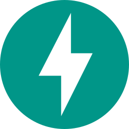

<!-- Animated Header -->
<!--  -->

<!-- Typing Animation -->

## 👋 About Me

I'm a full-stack developer based in **Karachi, Pakistan**, focused on AI engineering building end-to-end applications powered by LLMs, RAG pipelines, and agentic AI.

I work professionally as a full-time software developer where I've built backend systems, REST APIs, and full-stack web applications across industries like finance, customs and many more. Outside of work I'm focused on AI projects, exploring new tools in the space, and moving deeper into AI engineering.

- 🔭 Currently building **MotionMap**: a real-time, offline webcam classifier that maps objects to system actions
- 🌱 Currently learning **Claude API (Anthropic)**
- 🛠️ Recent projects **AskMyDoc** & **AskMyData**
- 💼 Open to AI engineering roles & freelance work
- 💬 Ask me about RAG pipelines, LangChain, FastAPI, Next.js
- 📫 Reach me at bilalirfancontact@gmail.com
- 📍 Based in Karachi, Pakistan

## 🛠️ Tech Stack

### AI / ML
<table style="border:none;border-collapse:collapse;">
  <tr>
    <td align="center" width="96" style="border:none;"> Chroma</td>
    <td align="center" width="96" style="border:none;"> Claude</td>
    <td align="center" width="96" style="border:none;"> OpenAI</td>
    <td align="center" width="96" style="border:none;"> Codex</td>
  </tr>
</table>

### Backend
<table style="border:none;border-collapse:collapse;">
  <tr>
    <td align="center" width="96" style="border:none;"> Python</td>
    <td align="center" width="96" style="border:none;"> Django</td>
    <td align="center" width="96" style="border:none;"> FastAPI</td>
    <td align="center" width="96" style="border:none;"> Flask</td>
  </tr>
</table>

### Frontend
<table style="border:none;border-collapse:collapse;">
  <tr>
    <td align="center" width="96" style="border:none;"> React</td>
    <td align="center" width="96" style="border:none;"> JavaScript</td>
    <td align="center" width="96" style="border:none;"> TypeScript</td>
  </tr>
</table>

### Databases
<table style="border:none;border-collapse:collapse;">
  <tr>
    <td align="center" width="96" style="border:none;"> MongoDB</td>
    <td align="center" width="96" style="border:none;"> PostgreSQL</td>
    <td align="center" width="96" style="border:none;"> SQL Server</td>
  </tr>
</table>

### 🛠️ Tools & DevOps
<table style="border:none;border-collapse:collapse;">
  <tr>
    <td align="center" width="96" style="border:none;"> Git</td>
    <td align="center" width="96" style="border:none;"> GitHub</td>
    <td align="center" width="96" style="border:none;"> Postman</td>
    <td align="center" width="96" style="border:none;"> Vercel</td>
    <td align="center" width="96" style="border:none;"> VS Code</td>
    <td align="center" width="96" style="border:none;"> Linux</td>
  </tr>
</table>

## 📊 GitHub Stats

---

## 🏆 Certifications

| Certificate | Issuer | Year |
|---|---|---|
|  [Machine Learning A-Z: AI, Python & R](https://www.udemy.com/certificate/UC-8f80493e-e90c-4146-993c-0a3b51cee06f/) | Udemy | 2026 |
|  [Claude Code in Action](https://verify.skilljar.com/c/ccqmbxa5poy8) | Anthropic | 2026 |
|  [Introduction to Career Skills in Data Analytics](https://www.linkedin.com/learning/certificates/6206c4e1faf9280e9e377c11fdcff60c4c82cfd29b7c21df08b5280551d23ea8/?lipi=urn%3Ali%3Apage%3Ad_flagship3_profile_view_base_certifications_details%3BOkuyMCXUT1qDj46ODO801Q%3D%3D) | LinkedIn | 2024 |

---

## 🌐 Contact / Social

  
  &nbsp;&nbsp;&nbsp;&nbsp;
  
  &nbsp;&nbsp;&nbsp;&nbsp;
  

---

